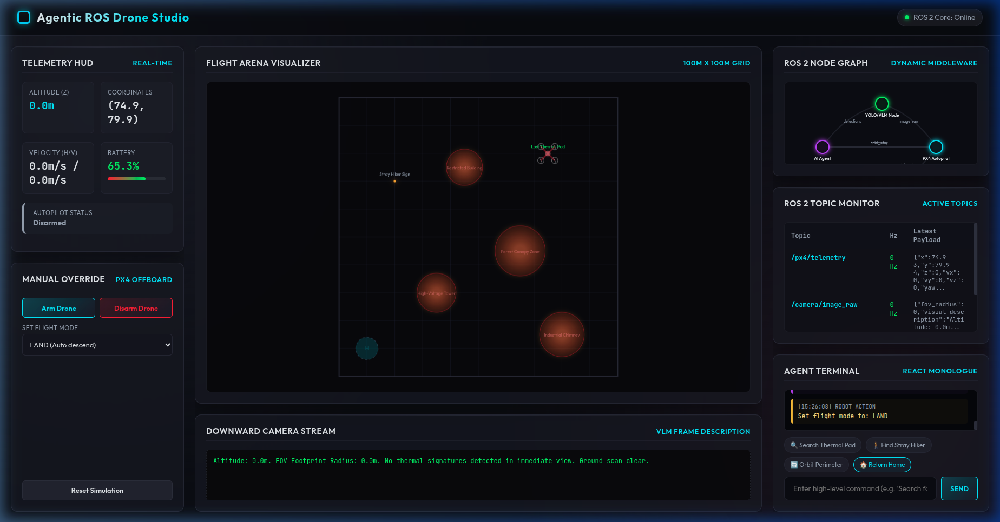
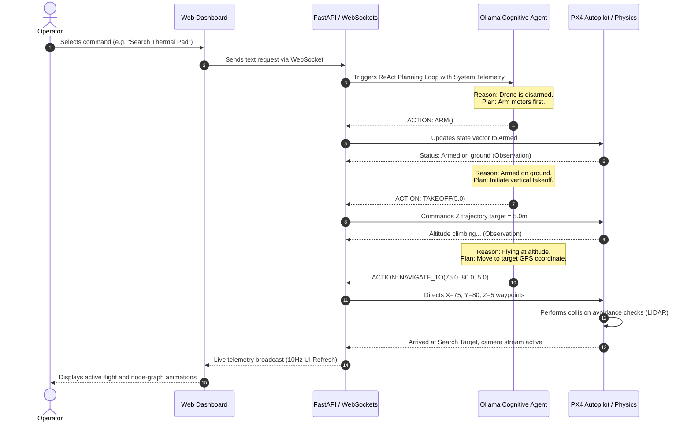

# Agentic ROS Drone Simulation & Control Studio

An advanced, high-fidelity Agentic ROS 2 drone simulation and telemetry studio. This project combines a cognitive AI planner (local Ollama LLM) using ReAct reasoning loop design with low-level PX4 Autopilot flight mechanics. It includes both a self-contained Web GUI simulator (glassmorphism HUD, canvas arena, live node graph) and a deployable ROS 2 Workspace for physical Gazebo SITL simulation.



---

## 1. System Architecture

```text
                                  +------------------------------------+
                                  |         Web Browser client         |
                                  |  (Glassmorphism UI, HTML5 Canvas)  |
                                  +------------------+-----------------+
                                                     ^
                                                     | WebSockets (Bidirectional)
                                                     v
+------------------+  HTTP API   +-------------------+-----------------+
|   Local Ollama   |<------------+           FastAPI Server            |
| (qwen3.5:0.8b)   |             |   (Mock ROS 2 Middleware & Physics) |
+------------------+             +---------+-------------------+-------+
                                           |                   |
                                           |                   | Writes to
                                           v                   v
                               +-----------+-----------+   +---+-------------------+
                               |  Mock ROS 2 Topics    |   | Deployable ROS2 WS    |
                               |  - /px4/telemetry     |   | (colcon package)      |
                               |  - /camera/image_raw  |   |                       |
                               |  - /perception/detect |   | - px4_offboard_bridge |
                               +-----------------------+   | - agent_cognitive_node|
                                                           +-----------------------+
```

---

## 2. Mission Control & System Flow



---

## 3. Key Capabilities

*   **ReAct Cognitive Loop:** Uses local LLM tool calling (`ARM()`, `TAKEOFF()`, `NAVIGATE_TO()`, `LAND()`) with a safety-first rule-based fallback autopilot override.
*   **Aesthetic UI HUD:** Premium glassmorphism design showing altitude, speed, coordinates, and real-time battery status bar.
*   **Visual Arena Canvas:** Renders drone position, geofenced boundaries, obstacles (High-Voltage Towers, Forest Canopies, Industrial Chimneys), targets, lidar rays, and camera field-of-view footprint.
*   **ROS 2 Node Graph & Monitor:** Animated SVG showing active ROS message flows between the `AI Agent`, `YOLO/VLM Node`, and `PX4 Autopilot` alongside active topic schemas.
*   **Deployable ROS 2 Package:** A real workspace configuration with nodes translating standard ROS 2 ENU coordinates into PX4 NED frames via uXRCE-DDS message layers.

---

## 4. Repository File Tree

```text
drone/
├── app.py                      # FastAPI Backend Server, Physics Engine & ReAct Loop
├── templates/
│   └── index.html              # Glassmorphism frontend UI dashboard and SVG graphics
├── start.sh                    # Launcher script (checks dependencies, starts server, opens browser)
├── setup_ros_gazebo.sh         # Helper script compiling workspace & showing Gazebo dependencies
├── README.md                   # Project overview & system architecture
└── ros2_ws/                    # Ready-to-compile local ROS 2 package
    ├── README.md
    └── src/
        └── agentic_drone_control/
            ├── package.xml
            ├── setup.cfg
            ├── setup.py
            ├── resource/
            │   └── agentic_drone_control
            ├── launch/
            │   └── agentic_drone.launch.py
            └── agentic_drone_control/
                ├── __init__.py
                ├── agent_node.py           # ROS 2 node calling local Ollama agent
                └── px4_offboard_controller.py # ROS 2 node bridging ENU commands to PX4 NED
```

---

## 5. Getting Started

### Option A: Quick Visual Simulation Dashboard
To launch the self-contained FastAPI server and open the graphical flight studio:
```bash
./start.sh
```
*Make sure you have your local Ollama server running with the `qwen3.5:0.8b` model pulled for live LLM planning. The server will use its internal rule-based agent simulator as a fallback if the local LLM is unreachable.*

### Option B: Real ROS 2 + Gazebo + PX4 Autopilot SITL
If you have a Linux system running ROS 2 Humble and PX4 SITL, you can compile and deploy the real flight control package:
```bash
# Verify installation commands and build the workspace
./setup_ros_gazebo.sh
```
Follow the printed terminal instructions to start the PX4 Gazebo simulator, start the XRCE-DDS broker bridge, and launch the agentic control nodes.
