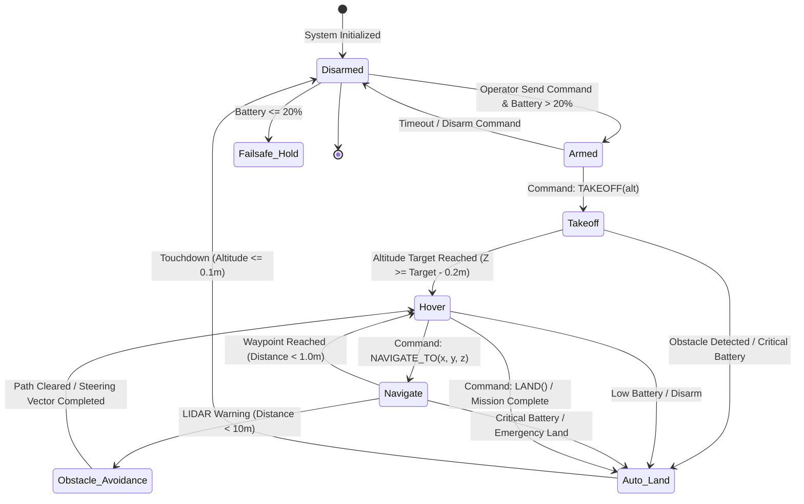
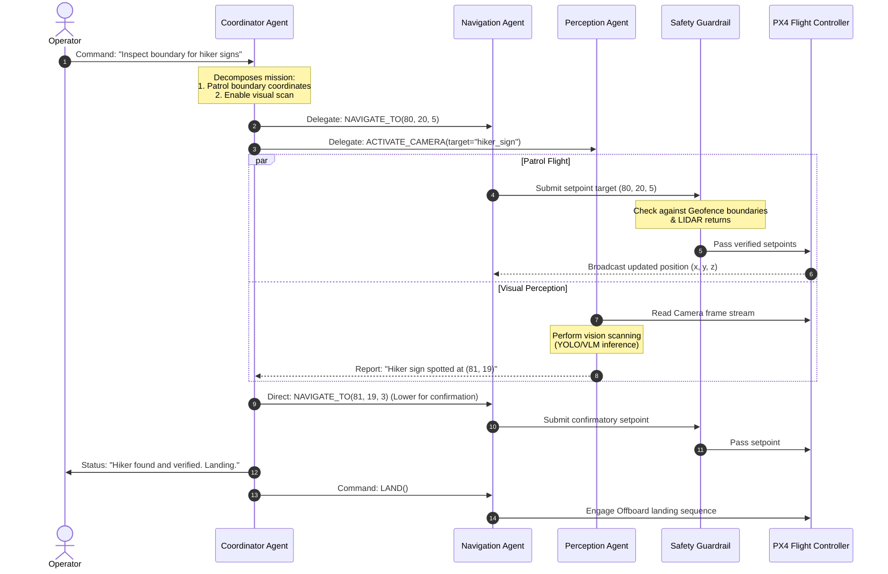
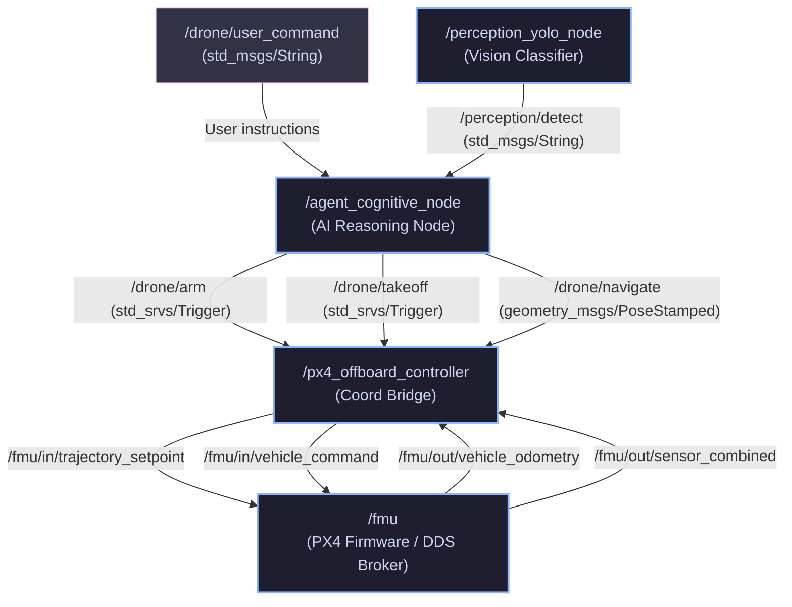

# Agentic ROS Drone: Mermaid Workflow Diagrams

This document contains high-fidelity Mermaid diagrams illustrating the runtime loops, state transitions, and node communication protocols of the drone simulation.

---

## 1. Drone State Machine & Decision Tree

This state machine traces the lifecycle of a mission, detailing the criteria for state transitions and safety loops.

---

## 2. Multi-Agent Task Delegation Pipeline

This sequence diagram illustrates how a complex inspection request (e.g., *"Inspect the forest boundary for hiker signs"*) is distributed across the coordinator, navigation worker, perception worker, and safety guardrails.

---

## 3. ROS 2 Node Topology & Communication Graph

This layout shows how nodes, topics, and service lines correspond to the physical deployment configuration in the ROS 2 workspace.

