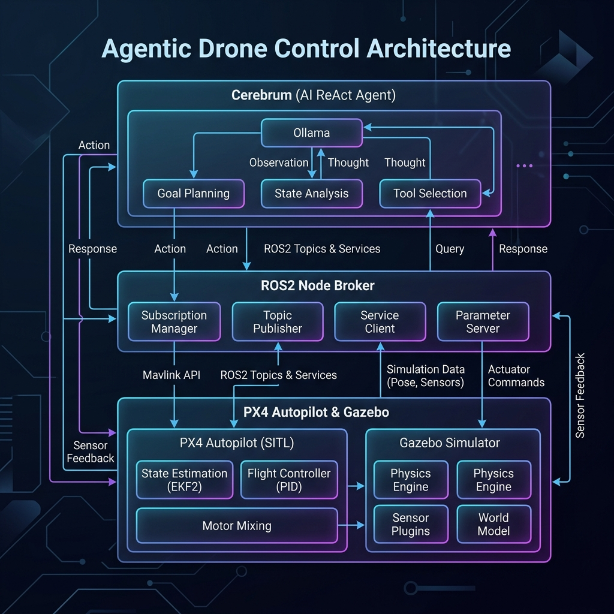
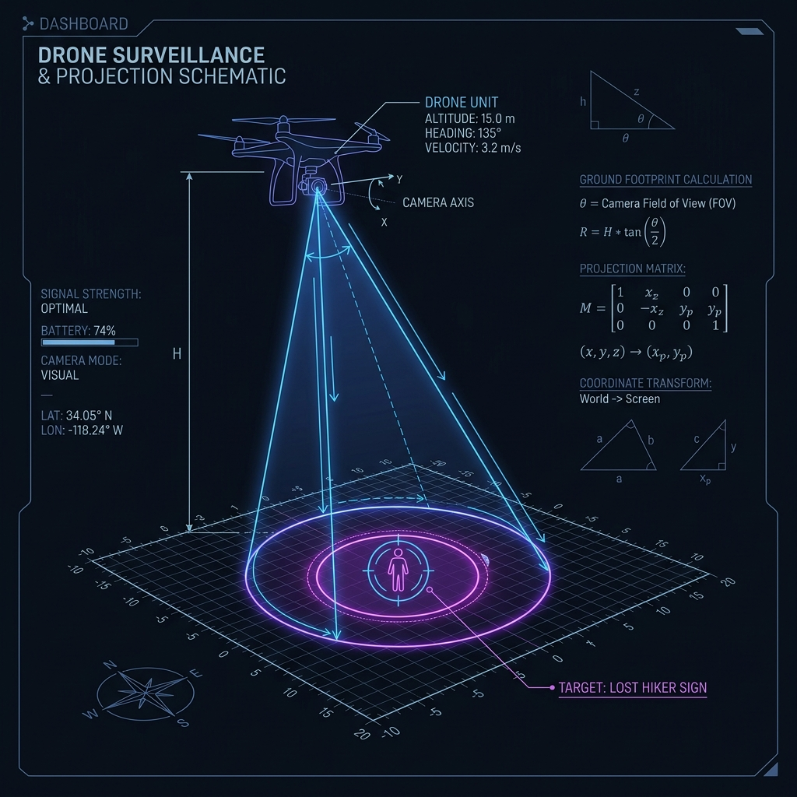

# Emerging Agentic Drone Control Frameworks: Architectural Deep Dive

This document provides a technical and structural analysis of the three leading frameworks for integrating Large Language Models (LLMs) and Multimodal Models (LMMs) with autonomous aerial vehicles.

---

## 1. AgenticROS (LLM-to-ROS 2 Message Mapping)



**Concept:** Translates high-level natural language requests directly into ROS 2 topic publications, service requests, and action triggers via a dynamic interface mapper.

### Architecture Diagram

```text
  +-----------------------------------------------------------+
  |                   Cognitive Agent Layer                   |
  |  [User Command] --> [Prompt Construction] --> [LLM Engine]  |
  +-----------------------------+-----------------------------+
                                |
                                | Outputs Action JSON
                                v
  +-----------------------------------------------------------+
  |                   AgenticROS Bridge Node                  |
  |  1. Parses LLM Action JSON                                |
  |  2. References ROS 2 Interface Schema Directory           |
  |  3. Resolves topic types and service names dynamically    |
  +--------+--------------------+--------------------+--------+
           |                    |                    |
           | Publishes          | Calls              | Sends
           v                    v                    v
     [/cmd_vel]              [/arm]            [/navigate_to]
  [Topic Publisher]     [Service Client]       [Action Client]
```

### System Flow
1.  **Command Parsing:** The operator commands: *"Move forward 2 meters at 0.5 m/s."*
2.  **Interface Resolution:** The LLM outputs: `{"interface_type": "topic", "name": "/cmd_vel", "msg_type": "geometry_msgs/Twist", "data": {"linear": {"x": 0.5}}}`.
3.  **Dynamic Invocation:** AgenticROS uses Python's dynamic import capabilities to construct the `geometry_msgs.msg.Twist` object at runtime and publishes it, bypassing the need for pre-compiled hardcoded nodes for every command.

---

## 2. AeroAgent / ROSchain (Multimodal Visual-Motor Grounding)

**Concept:** Connects Large Multimodal Models (LMMs, e.g., GPT-4o, LLaVA) directly to real-time drone sensory cameras and telemetry feeds. This enables the agent to "see" the environment and directly adjust the flight path.

### Architecture Diagram

```text
  +-----------------------------------------------------------------+
  |                        Perception Inputs                        |
  |   [HD Video Feed / Camera]           [Telemetry/Odometry Feed]  |
  +-----------+-------------------------------------+---------------+
              |                                     |
              v Frame Extraction                    v Telemetry JSON
  +-----------+-------------------------------------+---------------+
  |                      Visual-Motor Grounder                      |
  |   - Overlays flight grids on camera pixels                      |
  |   - Encodes spatial telemetry into text-visual embeddings       |
  +---------------------------------+-------------------------------+
                                    |
                                    v Multimodal Prompt
  +---------------------------------+-------------------------------+
  |                          LMM Engine                             |
  |   Processes images + text to reason: "Is target hiker visible?" |
  +---------------------------------+-------------------------------+
                                    |
                                    v Trajectory Waypoints
  +---------------------------------+-------------------------------+
  |                      PX4 / Gazebo Control                       |
  |   Executes raw trajectory setpoint commands in simulated space   |
  +-----------------------------------------------------------------+
```

### System Flow
1.  **Visual Overlays:** The system embeds current coordinates directly onto the downward camera frame pixels.
2.  **Multimodal Querying:** The visual frame and the request *"Identify and land near the yellow thermal sign"* are sent to the LMM.
3.  **Spatial Coordinate Grounding:** The LMM identifies the target sign in visual pixel space `[x=450, y=200]` and translates this pixel coordinate into relative GPS/geodetic coordinates to update the flight controller target.

---

## 3. Hierarchical Inspection Agents (Coordinator & Worker Split)

**Concept:** Employs a multi-agent hierarchy to divide planning from critical safety execution. A high-level Coordinator Agent breaks down complex user goals, while low-level Worker and Safeguard Agents manage specific drone functions.

### Architecture Diagram

```text
                            +--------------------------+
                            |     Operator Input       |
                            | "Inspect pressure gauge" |
                            +------------+-------------+
                                         |
                                         v
                            +------------+-------------+
                            |    Coordinator Agent     |
                            | (Mission-level Planner)  |
                            +------------+-------------+
                                         |
                       +-----------------+-----------------+
                       | Decomposes task into sub-goals   |
                       v                                   v
          +------------+------------+         +------------+------------+
          |      Navigation Agent    |         |    Perception Worker     |
          |   (Handles flight paths) |         | (Processes camera feeds) |
          +------------+------------+         +------------+------------+
                       |                                   |
                       +-----------------+-----------------+
                                         | Writes state to
                                         v
                            +------------+-------------+
                            |    Safeguard / Geofence  |
                            | (Strict safety check loop|
                            |  overrides bad commands) |
                            +------------+-------------+
                                         |
                                         v Validated commands
                            +------------+-------------+
                            |     PX4 Autopilot SITL   |
                            +--------------------------+
```

### System Flow
1.  **Task Decomposition:** The Coordinator receives: *"Inspect the industrial boiler's thermal signature."* It breaks this down into two sub-goals:
    *   *Sub-goal 1:* Fly to boiler coordinates `(25, 45, 3)`.
    *   *Sub-goal 2:* Extract thermal signature and verify temperature thresholds.
    *   The **Navigation Agent** commands the PX4 controller to fly to `(25, 45, 3)`.
    *   The **Perception Worker** watches the camera stream for the boiler's ID tag.
3.  **Safety Intercept:** If the Navigation Agent commands a path crossing a geofence limit, the **Safeguard Agent** immediately overrides the command and forces a safe hover.

---

## 4. Control Loop Latency Decoupling (Cerebrum vs. Cerebellum)

One of the greatest challenges in agentic robotics is the **order-of-magnitude mismatch** in control frequencies between LLM inference and raw flight dynamics:

*   **Attitude/Rate Loop (PX4):** Runs at **250Hz - 800Hz** to stabilize quadcopter flight vectors.
*   **Offboard Setpoint Heartbeat (ROS 2):** Requires a constant command flow at **10Hz - 50Hz**. If this heartbeat drops for more than 500ms, the PX4 Autopilot instantly fails-safe (failsafe hover or land) to prevent flyaways.
*   **Cognitive Loop (LLM):** Takes **300ms - 2500ms** to generate a single decision.

To bridge this, we use a **Decoupled Asynchronous Controller**:

```text
  +-----------------------------------------------------------+
  |              Cognitive Agent (Slow Loop: ~0.5Hz)          |
  |  - Reasoning & Decision Making                            |
  |  - Emits: Target Coordinate (e.g. NAVIGATE_TO(25, 45, 5))  |
  +-----------------------------+-----------------------------+
                                |
                                | Writes Target Setpoint (Async)
                                v
  +-----------------------------------------------------------+
  |              Offboard Node (Fast Loop: 20Hz - 50Hz)       |
  |  - Continuously sends vehicle_command heatbeats to PX4    |
  |  - Calculates intermediate step vectors (Interpolation)   |
  |  - Actively reads current state odometry                  |
  +-----------------------------------------------------------+
```

---

## 5. Mathematical & Spatial Grounding in Prompting



To navigate successfully, the LLM must translate visual pixels or relative positions into metric setpoints. This is accomplished using **Visual Coordinate Projection**:

$$\begin{bmatrix} X_c \\ Y_c \\ Z_c \end{bmatrix} = R \cdot \begin{bmatrix} X_w \\ Y_w \\ Z_w \end{bmatrix} + T$$

1.  **Pixel Projection:** An object spotted at pixel coordinates $[u, v]$ by the downward camera is projected onto the ground plane using the current altitude $z$ and camera field-of-view (FOV) angles.
2.  **Relative Metric Estimation:** The perception node converts this into a relative vector $(\Delta x, \Delta y)$ in meters from the drone.
3.  **Prompt Grounding:** Instead of feeding raw images, the perception node populates the text context:
    > *"Object identified: Lost Hiker. Estimated location: 12 meters East, 4 meters North of current position."*
4.  **Vector Calculation:** The LLM reads this and mathematically adds the delta values to its current position $(X, Y)$ to issue the precise command:
    > `ACTION: NAVIGATE_TO(current_x + 12, current_y + 4, 3)`

---

## 6. Rule-Based Deterministic Safety Interceptors

Because LLMs can hallucinate or output out-of-bounds variables, the system implements **deterministic runtime filters** (guardrails) before any command reaches the hardware.

```text
  [LLM Output Command] ---> [Regex Syntax Validator]
                                   | (Valid format?)
                                   +--> NO  --> [Fallback Autopilot Override]
                                   | YES
                                   v
                      [Geofence & Range Validator]
                                   | (Within 0-100m, altitude < 30m?)
                                   +--> NO  --> [Clamp Values / Force Safe Hover]
                                   | YES
                                   v
                      [PX4 Flight Controller (Hardware)]
```

*   **Syntax Check:** If the LLM generates a malformed command (e.g., `NAV_TO(x=10)` instead of `NAVIGATE_TO(10, 0, 5)`), the parser catches the regex failure and falls back to a deterministic state machine.
*   **Physical Clamp:** If the LLM commands an altitude of $Z = 500\text{m}$, the low-level ROS node intercepts this and clamps the value to the maximum geofenced altitude of $Z = 30\text{m}$.

